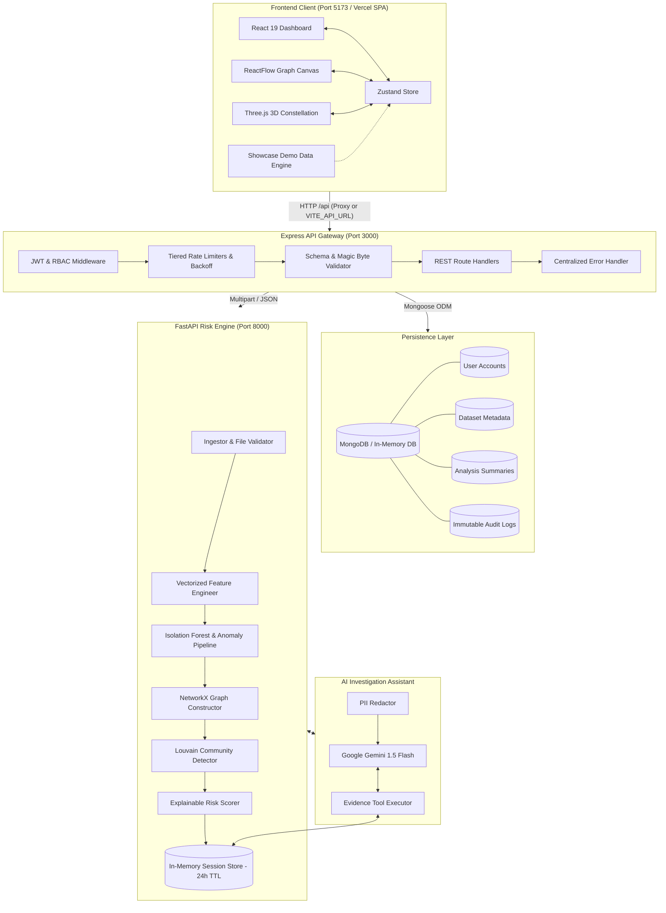
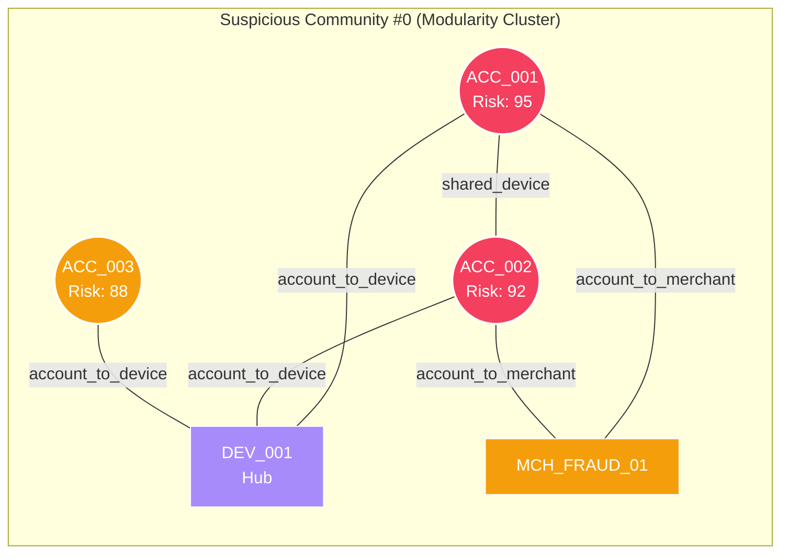
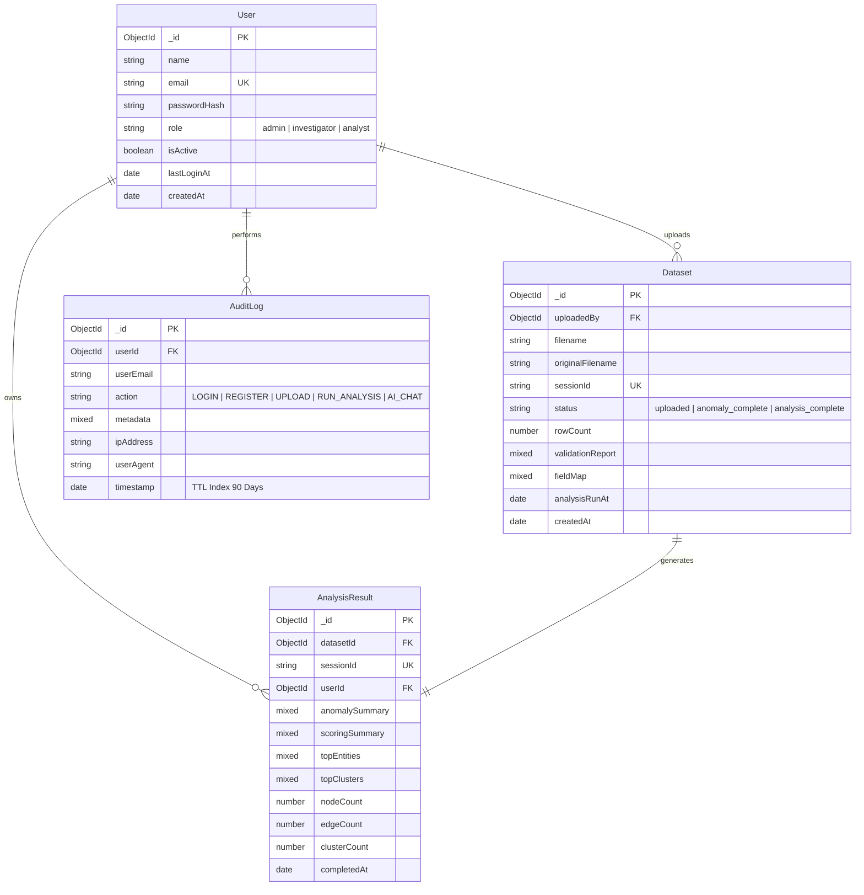

# TraceX

### AI-Powered Financial Fraud Network Detection & Forensic Intelligence Platform

[](https://fastapi.tiangolo.com)
[](https://expressjs.com)
[](https://react.dev)
[](https://vitejs.dev)
[](https://tailwindcss.com)
[](https://networkx.org)
[](https://scikit-learn.org)
[](https://threejs.org)
[](https://www.mongodb.com)
[](https://ai.google.dev)
[](https://vercel.com)

> **TraceX** transforms static transaction ledgers into dynamic, explainable intelligence graphs. It combines unsupervised anomaly detection (Isolation Forest & statistical velocity signals), graph community partitioning (Louvain modularity optimization), hardware-accelerated 3D WebGL visualizations, and an evidence-grounded AI copilot to uncover coordinated fraud rings, shared device syndicates, and money laundering funnels.

---

## Table of Contents

- [1. Project Overview](#1-project-overview)
- [2. Problem Statement](#2-problem-statement)
- [3. Our Solution](#3-our-solution)
- [4. Key Features](#4-key-features)
- [5. Instant Showcase Demo Mode](#5-instant-showcase-demo-mode)
- [6. Technology Stack](#6-technology-stack)
- [7. System Architecture](#7-system-architecture)
- [8. How TraceX Works (Pipeline)](#8-how-tracex-works-pipeline)
- [9. Machine Learning & Anomaly Math](#9-machine-learning--anomaly-math)
- [10. Graph Theory & Community Mining](#10-graph-theory--community-mining)
- [11. Explainable Risk Scoring Engine](#11-explainable-risk-scoring-engine)
- [12. Visualizations & 3D Analytics](#12-visualizations--3d-analytics)
- [13. Platform Workspaces & Views](#13-platform-workspaces--views)
- [14. Database Schema Design](#14-database-schema-design)
- [15. REST API Reference](#15-rest-api-reference)
- [16. Project Structure](#16-project-structure)
- [17. Installation & Local Setup](#17-installation--local-setup)
- [18. Deployment Guide (Vercel & Cloud)](#18-deployment-guide-vercel--cloud)
- [19. Environment Variables](#19-environment-variables)
- [20. Security & Hardening](#20-security--hardening)
- [21. Advantages & Impact](#21-advantages--impact)
- [22. Limitations & Future Scope](#22-limitations--future-scope)
- [23. Explain TraceX in 60 Seconds](#23-explain-tracex-in-60-seconds)
- [24. License](#24-license)

---

## 1. Project Overview

Financial crime has evolved from isolated bad actors committing single-card theft to sophisticated, distributed fraud syndicates operating across multiple accounts, shared devices, IP subnets, and compromised merchant gateways. 

Traditional rule-based fraud detection systems (such as static velocity checks or per-transaction thresholds) fail because **each individual transaction is engineered to appear normal**. When bad actors disperse funds across dozens of mule accounts and execute micro-transactions below reporting thresholds, point-in-time checks remain blind.

**TraceX** solves this by unifying:
1. **Unsupervised Anomaly Scoring**: Evaluates multivariate deviation and velocity anomalies per transaction.
2. **Heterogeneous Graph Construction**: Maps relational connections between Accounts, Hardware Devices, Merchants, and Geo-Locations.
3. **Graph Community Partitioning**: Detects tightly connected subgraphs and criminal syndicates using modularity optimization.
4. **Explainable Risk Scoring**: Breaks down entity and network risk into clear, auditable signals on a 0–100 scale.
5. **Evidence-Grounded AI Copilot**: Enables investigators to query evidence interactively with LLM tool-calling.
6. **3D Telemetry & Visual Triaging**: Hardware-accelerated Three.js 3D Risk Orb, particle constellations, and interactive ReactFlow graph canvas.

---

## 2. Problem Statement

Modern financial fraud is decentralized and coordinated:
- **Mule Networks & Synthetic Identities**: Fraud rings deploy hundreds of newly opened or bought accounts controlled by single physical devices.
- **Micro-Structuring & Smurfing**: Transactions are timed and structured to evade traditional threshold triggers ($<\$10,000$ CTR).
- **High False Positive Rates**: Legacy rule systems drown compliance teams in thousands of disconnected alerts ($>90\%$ false positive rate), causing critical fraud rings to be missed.
- **Black-Box AI Skepticism**: Investigators and regulators (FinCEN, FATF) cannot legally act on unexplainable machine learning probabilities without concrete evidence trails.
- **Relational Invisibility**: Relational patterns—such as 5 accounts sharing 2 device IDs and transacting at the same merchant within 10 minutes—are invisible in tabular SQL queries.

> **Core Philosophy**: *"You cannot stop an organized criminal network using single-point defenses."*

---

## 3. Our Solution

TraceX processes raw banking ledgers through an 8-phase pipeline that progresses from raw data ingestion to interactive 3D network investigation:

```
┌─────────────────────────┐
│ Raw Banking Ledger CSV  │
└────────────┬────────────┘
             │
             ▼
┌─────────────────────────┐
│ Ingest & Magic Byte Val │ ◄── Rejects disguised binaries & validates canonical columns
└────────────┬────────────┘
             │
             ▼
┌─────────────────────────┐
│  Feature Engineering    │ ◄── Rolling 1h/24h counts, per-account z-scores, 7d/30d shift
└────────────┬────────────┘
             │
             ▼
┌─────────────────────────┐
│ Anomaly Detection (ML)  │ ◄── Isolation Forest (40%) + Statistical Velocity Signals (60%)
└────────────┬────────────┘
             │
             ▼
┌─────────────────────────┐
│ Heterogeneous Graph     │ ◄── NetworkX Graph: Account ↔ Device ↔ Merchant ↔ Location
└────────────┬────────────┘
             │
             ▼
┌─────────────────────────┐
│ Community & Hub Mining  │ ◄── Louvain Modularity + Betweenness Centrality
└────────────┬────────────┘
             │
             ▼
┌─────────────────────────┐
│ Explainable Risk Score  │ ◄── 0–100 Entity & Cluster scoring with human-readable factors
└────────────┬────────────┘
             │
             ▼
┌─────────────────────────┐
│  Visual Intelligence    │ ◄── ReactFlow Graph + WebGL 3D Canvas + Gemini AI Copilot
└─────────────────────────┘
```

---

## 4. Key Features

### 🔍 Fraud & Anomaly Detection
- **Adaptive Isolation Forest**: 200-tree randomized decision ensemble trained adaptively on multi-dimensional transaction feature vectors.
- **Rolling Velocity & Frequency Spikes**: Real-time rolling window analysis (1-hour & 24-hour windows) detecting burst velocity.
- **Per-Account Amount Z-Scores**: Flags transactions that statistically deviate ($>3\sigma$) from that specific account's spending baseline.
- **Behavioral Shift Identification**: Flags sudden 7-day volume surges relative to an account's 30-day historical baseline.
- **Circadian Rhythm / Timing Anomaly**: Detects nocturnal (00:00–05:00) transactions and percentile timing deviations.

### 🕸️ Graph Network Investigation
- **Heterogeneous Entity Modeling**: Multi-entity graphs resolving Accounts (Cyan), Devices (Violet), Merchants (Amber), and Locations (Emerald).
- **Shared Entity Linking**: Discovers hidden Account $\leftrightarrow$ Account relationships linked via identical hardware signatures or digital footprints.
- **Supernode Clique Explosion Defense**: Prevents $O(N^2)$ graph explosions on massive merchant nodes using degree-adaptive thresholds ($>25$ links).
- **Louvain Modularity Partitioning**: Identifies dense community clusters and organized fraud rings.
- **Betweenness Centrality & Hub Identification**: Pinpoints key connector nodes and money mules bridging disparate subgraphs.

### 🤖 AI Investigation Assistant
- **Evidence-Grounded Copilot**: Powered by Google Gemini 1.5 Flash via native function/tool-calling.
- **Autonomous Tool Execution**: The assistant executes internal queries (`get_entity_risk`, `get_cluster_summary`, `get_top_anomalies`, `get_connections`) directly against the session evidence store.
- **Anti-Hallucination Constraints**: Strictly configured to reject speculative queries and only state facts returned by analysis tools.
- **Redaction & Data Privacy**: Client PII and sensitive identifiers are tokenized before leaving the secure perimeter.
- **Fallback Mock Mode**: Runs fully offline with built-in mock responses if no API key is supplied.

### 📊 Investigative Dashboard
- **3D WebGL Constellation**: Interactive Three.js canvas visualizing live graph topology, particle energy pulses, and pulsing threat halos.
- **3D Risk Telemetry Orb**: Real-time rotating threat gauge reflecting aggregate case risk posture ($0 - 100$).
- **Interactive ReactFlow Canvas**: Dynamic radial cluster layout with minimap, search filters, zoom controls, and edge animation on risky connections.
- **Slide-Out Entity Audit Drawer**: Full transaction history, risk score decomposition, centrality metrics, and contributing factors for any selected node.
- **Interactive Fraud Story Simulator**: Step-by-step interactive walkthrough demonstrating how a single "innocent" transaction unmasks a multi-card fraud syndicate.

---

## 5. Instant Showcase Demo Mode

TraceX features a built-in, zero-configuration **Showcase Demo Mode** designed for instant cloud previews, evaluator reviews, and hackathon demonstrations without needing a live backend running:

- **Pre-Loaded Operation Hydra Syndicate Case**:
  - $1,248$ transactions with $76$ statistical anomalies.
  - **3 Coordinated Fraud Clusters**: Synthetic Identity Ring (Score 96), Shell Merchant Funnel (Score 89), and Smurfing/Wash Trading Ring (Score 81).
  - Fully populated 3D Network Graph with interactive nodes, animated payout edges, and burner hardware hubs (`DEV-991`).
  - Pre-trained AI Copilot responses for quick prompts (*"Which network cluster should I investigate first?"*, *"Check cluster 0"*, *"Show top anomalous transactions"*).
- **How to Use**:
  - Click **"Explore Showcase Demo (Instant Preview)"** on the Landing Page or Login Page.
  - The platform immediately transitions into the complete investigation dashboard with full 3D visuals and analytics enabled.
  - An **Environment Badge** in the sidebar clearly indicates whether the platform is running in `Showcase Demo` or `Live Backend` mode.

---

## 6. Technology Stack

| Layer | Technology | Version | Purpose & Selection Rationale |
| :--- | :--- | :--- | :--- |
| **Frontend UI** | React | `19.2.8` | Component-based reactive user interface for fast state transitions |
| **Build Tool** | Vite | `8.2.2` | Ultra-fast HMR and optimized production bundling |
| **Styling** | Tailwind CSS | `3.4.19` | Utility-first styling with dark-mode palette and glassmorphism |
| **Graph UI** | ReactFlow | `11.11.4` | Interactive node-link canvas supporting custom React components & minimap |
| **3D WebGL** | Three.js | `0.185.1` | Hardware-accelerated 3D particle constellation and risk telemetry gauges |
| **Charts** | Recharts | `3.10.1` | Declarative SVG bar charts and pie charts for distribution analytics |
| **Icons** | Heroicons | `2.2.0` | Accessible, clean UI iconography |
| **State Store** | Zustand | `5.0.15` | Lightweight, boilerplate-free state management across investigation views |
| **API Client** | Axios | `1.7.2` | HTTP client with automatic Bearer token injection and dynamic base URL |
| **Backend API** | Node.js / Express | `4.19.2` | High-throughput REST API gateway with middleware composition |
| **Database** | MongoDB / Mongoose | `8.4.3` | Document store for case metadata, user accounts, and immutable audit trails |
| **In-Memory DB** | mongodb-memory-server | `11.2.0` | Zero-setup development database that runs without external MongoDB installation |
| **Security** | Helmet | `7.1.0` | HTTP header security and strict Content Security Policy |
| **Auth & Crypto**| bcryptjs & jsonwebtoken | `2.4.3` / `9.0.2` | Salted password hashing (12 rounds) and stateless JWT authentication |
| **Rate Limiting**| express-rate-limit | `7.3.1` | Tiered DDoS & brute-force protection with exponential backoff on auth |
| **Validation** | express-validator | `7.1.0` | Strict schema validation enforcing hex ObjectIds, UUIDs, and input sanitization |
| **ML Engine** | Python / FastAPI | `0.115.0` | High-performance asynchronous Python REST API for machine learning |
| **Server** | Uvicorn | `0.31.0` | ASGI web server running the Python ML engine |
| **Data Engine** | Pandas & NumPy | `2.2.3` / `2.1.0` | High-speed vectorized tabular data manipulation and rolling window math |
| **Excel Parser** | OpenPyXL | `3.1.5` | Safe spreadsheet parsing with macro execution disabled (`data_only=True`) |
| **ML Library** | Scikit-Learn | `1.5.2` | Isolation Forest ensemble and StandardScalar preprocessing |
| **Graph Engine** | NetworkX | `3.4.0` | In-memory heterogeneous graph construction and centrality computation |
| **Clustering** | python-louvain | `0.16.0` | High-speed community detection optimizing graph modularity |
| **AI Copilot** | Google Generative AI | `0.8.6` | Gemini 1.5 Flash integration with structured function/tool-calling |

---

## 7. System Architecture



---

## 8. How TraceX Works (Pipeline)

### Step 1 — Data Ingestion & Security Validation
- The investigator uploads a transaction ledger (`.csv`, `.xlsx`, `.xls`, `.xlsm`, or `.txt`).
- **Magic Byte & Executable Signature Validation**: Binary headers are checked to reject Windows executables (`MZ`), Linux binaries (`\x7fELF`), Mach-O, Java bytecode (`0xCAFEBABE`), WebAssembly (`\x00asm`), and Unix shell scripts (`#!`). Text files containing null bytes (`\x00`) or disguised `<script>` tags are rejected.
- **Zip Bomb Defense**: `.xlsx` archives are pre-inspected for decompression bombs (verifying uncompressed size $<500\text{ MB}$ and compression ratio $<100:1$).
- **Column Auto-Detection**: Dynamically maps vendor column headers (e.g., `cc_num`, `sender`, `source_account` $\rightarrow$ `account_id`; `amt`, `val`, `price` $\rightarrow$ `amount`).

### Step 2 — Data Normalization & Cleaning
- Normalizes amounts to numeric float values, dropping NaN/corrupted amounts while flagging negative or zero-value transactions.
- Resolves timestamp formats (ISO strings, epoch seconds, or synthetic sequential timestamps).
- Implements **Smart Representative Sampling** on massive datasets ($>5,000$ rows) to preserve all flagged anomalous records while maintaining real-time WebGL/ReactFlow rendering performance.

### Step 3 — Feature Engineering
Vectorized rolling transformations extract behavioral and temporal signals:
- `hour_of_day`, `day_of_week`, `is_weekend`, `is_night` (midnight to 06:00).
- `mins_since_last_txn`: Time delta between consecutive transactions for the same account.
- `log_amount`: $\ln(1 + \text{amount})$ to compress extreme distributions.
- `amount_zscore`: Standard deviation score against that specific account's baseline:
  $$\text{Z-Score} = \frac{\text{amount} - \mu_{\text{account}}}{\sigma_{\text{account}}}$$
- `amount_percentile`: Global percentile rank across the entire ledger.
- `txn_count_1h` & `txn_count_24h`: Rolling transaction counts in the preceding 1-hour and 24-hour windows.
- `freq_spike_flag`: Flags burst velocity exceeding account mean $+ 3\sigma$.
- `behavioral_shift_flag`: Flags accounts whose 7-day rolling mean spend suddenly exceeds $2\times$ their 30-day baseline.

---

## 9. Machine Learning & Anomaly Math

A composite anomaly score ($0.0 \text{ to } 1.0$) is calculated for every transaction:

$$\mathbf{S_{\text{composite}}} = 0.40 \cdot S_{\text{IF}} + 0.20 \cdot S_{\text{ZScore}} + 0.15 \cdot S_{\text{Freq}} + 0.10 \cdot S_{\text{Timing}} + 0.15 \cdot S_{\text{Shift}}$$

- **Isolation Forest ($S_{\text{IF}}$)**: Evaluates multivariate outliers across all engineered features with adaptive contamination tuning ($\min(0.15, \max(0.01, 50 / N))$).
- **Amount Z-Score ($S_{\text{ZScore}}$)**: Sigmoid-clipped scale reaching $1.0$ at $|Z| \ge 5.0$.
- **Frequency Spike ($S_{\text{Freq}}$)**: $1.0$ if 1-hour transaction velocity exceeds historical bounds.
- **Unusual Timing ($S_{\text{Timing}}$)**: Evaluates whether the transaction hour falls in the account's bottom 5th percentile.
- **Behavioral Shift ($S_{\text{Shift}}$)**: $1.0$ if medium-term volume diverges from long-term profile.

---

## 10. Graph Theory & Community Mining



### Graph Metrics in TraceX
- **Node Resolution**: Accounts (`#00D4FF`), Devices (`#A78BFA`), Merchants (`#F59E0B`), Locations (`#34D399`).
- **Louvain Modularity Optimization ($Q$)**: Partitions the graph into isolated communities to expose fraud rings:
  $$Q = \frac{1}{2m} \sum_{ij} \left[ A_{ij} - \frac{k_i k_j}{2m} \right] \delta(c_i, c_j)$$
- **Betweenness Centrality ($C_B$)**: Measures the fraction of all shortest paths passing through each node to detect money mules:
  $$C_B(v) = \sum_{s \ne v \ne t} \frac{\sigma_{st}(v)}{\sigma_{st}}$$
- **Supernode Defense**: High-degree aggregator merchants ($>25$ accounts) skip $O(N^2)$ pairwise edge generation to maintain layout stability.

---

## 11. Explainable Risk Scoring Engine

Computes a granular $0 \text{ to } 100$ score for every node and community:

$$\text{Score}_{\text{node}} = \min\Big(100, \, (30 \cdot \text{MaxAnomaly} + 10 \cdot \text{AvgAnomaly}) + (20 \cdot C_B) + \text{HubBonus} + \text{SharedEntityBonus} + \text{ClusterRiskBonus}\Big)$$

- **Anomaly Contribution** (up to 40 pts): Peak and average anomaly scores.
- **Network Centrality** (up to 20 pts): Graph betweenness centrality.
- **Hub Status** (+15 pts): If node is in top 10% centrality.
- **Shared Entity Footprint** (up to 15 pts): $3\text{ pts}$ per shared device/merchant link.
- **Community Risk** (up to 10 pts): $2\text{ pts}$ per internal shared-entity connection in the parent community.

### Risk Tiers
- 🔴 **CRITICAL** ($\ge 90$): High anomaly, multiple shared hardware links, core hub position.
- 🟠 **HIGH** ($70 - 89$): Elevated anomaly or significant shared-entity connectivity.
- 🟡 **MEDIUM** ($40 - 69$): Moderate statistical or topological deviation.
- 🟢 **LOW** ($0 - 39$): Normal baseline behavior.

---

## 12. Visualizations & 3D Analytics

1. **3D Risk Telemetry Gauge (`RiskOrb3D`)**: Continuous, hardware-accelerated 3D rotating wireframe sphere with pulsing particle cores and dynamic color shift (Emerald $\rightarrow$ Amber $\rightarrow$ Crimson).
2. **Interactive 3D Fraud Network Constellation (`FraudNetworkCanvas3D`)**: WebGL Three.js interactive universe of floating nodes, pulsing energy beams, and danger halos.
3. **Outlier Score Distribution Histogram**: Recharts `<BarChart>` showing transaction counts across anomaly bins (`0.0–0.2`, `0.2–0.4`, `0.4–0.6`, `0.6–0.8`, `0.8–1.0`).
4. **Entity Risk Tier Distribution**: Recharts donut `<PieChart>` segmenting Critical, High, Medium, and Low entities.
5. **Interactive Network Graph Canvas (`ReactFlow`)**: Radial cluster positioning with minimap, search filters, zoom controls, and edge animation on risky connections.

---

## 13. Platform Workspaces & Views

TraceX is organized into 6 dedicated investigation views:

```
┌────────────────────────────────────────────────────────────────────────────┐
│ 🌐 TraceX Platform Navigation                                              │
├──────────────┬──────────────┬──────────────┬───────────────┬───────────────┤
│ 1. Ingestion │ 2. Overview  │ 3. 3D Graph  │ 4. Suspicious │ 5. Entity     │ 6. AI Copilot │
│   & Schema   │   Telemetry  │  Investigation│   Networks    │   Directory   │   Assistant   │
└──────────────┴──────────────┴──────────────┴───────────────┴───────────────┴───────────────┘
```

1. **Ingestion & Schema View (`/upload`)**: Drag-and-drop file upload zone, instant CSV parsing report, detected column mappings, missing field warnings, and one-click instant demo launcher.
2. **Overview Dashboard (`/dashboard`)**: KPI cards (Total Transactions, Anomaly Rate, High-Risk Entities, Suspicious Clusters), 3D Risk Orb gauge, Outlier Distribution Bar Chart, and Risk Tier Donut Chart.
3. **Investigation Graph (`/graph`)**: Full-screen interactive ReactFlow network canvas with type filters, risk range sliders, community selectors, and minimap.
4. **Suspicious Networks (`/networks`)**: Card-based breakdown of all discovered Louvain communities with member counts, primary risk drivers, and direct jump-to-graph buttons.
5. **Entity Directory (`/entities`)**: Searchable tabular index of all resolved accounts, devices, and merchants with real-time text search, risk badges, and centrality rankings.
6. **AI Assistant (`/assistant`)**: Interactive chat interface with pre-built investigation queries, tool-call execution traces, and audit logs.

---

## 14. Database Schema Design



---

## 15. REST API Reference

### Express API Gateway (`http://localhost:3000`)

| Method | Endpoint | Auth | Description | Rate Limit |
| :--- | :--- | :--- | :--- | :--- |
| `POST` | `/api/auth/register` | Public | Create new investigator account | 10 req / 15 min |
| `POST` | `/api/auth/login` | Public | Authenticate user & return JWT token | Exponential backoff |
| `GET` | `/api/auth/me` | JWT | Fetch current authenticated user profile | 300 req / 15 min |
| `POST` | `/api/datasets/upload` | JWT | Upload transaction ledger (`.csv`, `.xlsx`, `.txt`) | 5 req / 1 min |
| `GET` | `/api/datasets` | JWT | List all user-accessible datasets | 300 req / 15 min |
| `GET` | `/api/datasets/:id` | JWT | Fetch single dataset metadata | 300 req / 15 min |
| `DELETE`| `/api/datasets/:id` | JWT | Delete dataset and cascade analysis results | 300 req / 15 min |
| `POST` | `/api/analysis/run/:id` | JWT | Trigger full ML anomaly & graph analysis | 10 req / 1 hour |
| `GET` | `/api/analysis/results/:id` | JWT | Fetch computed analysis summary | 300 req / 15 min |
| `GET` | `/api/graph/nodes/:sessionId` | JWT | Get resolved graph nodes and edges | 300 req / 15 min |
| `GET` | `/api/graph/clusters/:sessionId` | JWT | Get Louvain communities and threat clusters | 300 req / 15 min |
| `GET` | `/api/graph/entity/:sessionId/:id` | JWT | Get deep drill-down profile for entity | 300 req / 15 min |
| `GET` | `/api/graph/summary/:sessionId` | JWT | Get high-level case summary statistics | 300 req / 15 min |
| `POST` | `/api/graph/chat/:sessionId` | JWT | Query Gemini AI Copilot with tool-calling | 20 req / 1 min |
| `GET` | `/api/graph/chat-history/:sessionId` | JWT | Fetch session conversation history | 300 req / 15 min |
| `GET` | `/health` | Public | Service healthcheck probe | 60 req / 15 min |

---

## 16. Project Structure

```text
TraceX/
├── vercel.json                     # Root Vercel monorepo configuration
│
├── backend/                        # Node.js Express REST API Gateway (Port 3000)
│   ├── src/
│   │   ├── config/                 # Database configuration (MongoDB & In-Memory)
│   │   │   └── db.js
│   │   ├── middleware/             # Security & Request Processing
│   │   │   ├── auth.js             # JWT verification & user injection
│   │   │   ├── errorHandler.js     # Sanitized error handler (no leakages)
│   │   │   ├── rateLimiter.js      # 6-tier configurable rate limiters & backoff
│   │   │   ├── rbac.js             # Role-based access control (investigator/admin)
│   │   │   ├── schemas.js          # Express-validator schema definitions
│   │   │   └── validate.js         # Centralized 400 validation rejector
│   │   ├── models/                 # Mongoose Data Models
│   │   │   ├── AnalysisResult.js
│   │   │   ├── AuditLog.js
│   │   │   ├── Dataset.js
│   │   │   └── User.js
│   │   ├── routes/                 # Express Route Handlers
│   │   │   ├── analysis.js
│   │   │   ├── auth.js
│   │   │   ├── datasets.js
│   │   │   └── graph.js
│   │   ├── utils/                  # Security & Operational Utilities
│   │   │   ├── auditLogger.js      # Non-blocking MongoDB audit logger
│   │   │   ├── fileValidator.js    # Magic byte inspection & binary blocklist
│   │   │   ├── mlErrorHandler.js   # Unified ML proxy error handler
│   │   │   └── seeder.js           # First-run investigator account seeder
│   │   └── index.js                # Express App Entrypoint & CORS setup
│   ├── .env.example                # Backend environment template
│   └── package.json
│
├── frontend/                       # React 19 + Vite Client Application (Port 5173)
│   ├── vercel.json                 # Frontend SPA client-side rewrite rules
│   ├── .env.example                # Frontend environment template (VITE_API_URL)
│   ├── src/
│   │   ├── api/                    # Axios API client & dynamic base URL handler
│   │   │   └── index.js
│   │   ├── components/
│   │   │   ├── 3d/                 # Three.js 3D WebGL components
│   │   │   │   ├── FraudNetworkCanvas3D.jsx
│   │   │   │   ├── RiskOrb3D.jsx
│   │   │   │   └── TiltCard3D.jsx
│   │   │   ├── entities/           # Entity directory & slide-out audit drawers
│   │   │   ├── graph/              # ReactFlow custom nodes & connectors
│   │   │   ├── layout/             # Top navbar, sidebar & environment badges
│   │   │   ├── networks/           # Suspicious network cluster cards
│   │   │   ├── upload/             # Drag-and-drop zone & validation reports
│   │   │   └── visualizer/         # FraudStorySimulator.jsx (Interactive Story)
│   │   ├── data/                   # Pre-seeded sample datasets
│   │   │   └── demoData.js         # Operation Hydra showcase dataset
│   │   ├── pages/                  # Page routes (Dashboard, Graph, Networks, etc.)
│   │   ├── store/                  # Zustand state management & Demo Mode engine
│   │   │   └── analysisStore.js
│   │   ├── App.jsx                 # Router & Authentication Gates
│   │   └── main.jsx
│   ├── vite.config.js              # Vite server & proxy configuration
│   └── package.json
│
└── ml-engine/                      # Python FastAPI Risk Engine (Port 8000)
    ├── app/
    │   ├── api/                    # FastAPI Routers
    │   │   ├── anomaly_router.py   # Anomaly detection endpoints
    │   │   ├── assistant_router.py # Gemini chat endpoints
    │   │   ├── graph_router.py     # Graph, clusters, and entity endpoints
    │   │   └── pipeline_router.py  # Ingestion & file upload endpoints
    │   ├── assistant/              # Gemini AI Copilot
    │   │   ├── chat.py             # Chat handler & function-calling loop
    │   │   ├── redactor.py         # PII tokenization & redaction
    │   │   └── tools.py            # Evidence tool declarations & executor
    │   ├── core/                   # Engine Settings & In-Memory Store
    │   │   ├── config.py           # Pydantic BaseSettings & validators
    │   │   └── session_store.py    # In-memory DataFrame store (24h TTL)
    │   └── pipeline/               # Core Machine Learning & Graph Pipeline
    │       ├── anomaly.py          # Isolation Forest & composite anomaly scorer
    │       ├── clusters.py         # Louvain community detector & centrality
    │       ├── features.py         # Rolling frequency & behavioral engineer
    │       ├── graph.py            # NetworkX heterogeneous graph constructor
    │       ├── ingestor.py         # Magic byte & zip bomb safe file parser
    │       ├── scorer.py           # Explainable 0-100 entity risk scorer
    │       └── validator.py        # Normalizer & smart sampling
    ├── generate_sample_data.py     # Synthetic fraud ledger generator
    ├── main.py                     # FastAPI application entrypoint
    ├── requirements.txt            # Python dependencies
    └── .env.example                # ML Engine environment template
```

---

## 17. Installation & Local Setup

### Prerequisites
- **Node.js**: `v18.0.0` or higher
- **Python**: `3.10` or higher
- **Git**

---

### Step 1: Clone Repository
```bash
git clone https://github.com/amitsinghbhadouriya/TraceX.git
cd TraceX
```

---

### Step 2: Setup & Start Backend (Express API)
```bash
cd backend
npm install
cp .env.example .env
# Note: If no external MongoDB is running, TraceX automatically spawns an in-memory MongoDB!
npm run dev
```
*Backend runs on `http://localhost:3000`.*

---

### Step 3: Setup & Start ML Engine (FastAPI)
Open a new terminal window:
```bash
cd ml-engine
python -m venv .venv

# On Windows:
.venv\Scripts\activate
# On macOS / Linux:
source .venv/bin/activate

pip install -r requirements.txt
cp .env.example .env
# (Optional) Add your GEMINI_API_KEY in .env for live AI Copilot
python main.py
```
*ML Engine runs on `http://localhost:8000`.*

---

### Step 4: Setup & Start Frontend (React + Vite)
Open a third terminal window:
```bash
cd frontend
npm install
npm run dev
```
*Frontend runs on `http://localhost:5173`.*

---

### Step 5: Log In
- Open `http://localhost:5173` in your browser.
- **Default Seed Investigator Account**:
  - **Email**: `investigator@tracex.internal`
  - **Password**: `amit@2004` (or configured `SEED_INVESTIGATOR_PASSWORD`)
- *Or click **"Explore Showcase Demo (Instant Preview)"** to enter immediately!*

---

## 18. Deployment Guide (Vercel & Cloud)

### Deploying Frontend to Vercel

TraceX is pre-configured with dual Vercel configurations for monorepos:
- [**`vercel.json`**](vercel.json) *(Root)*: Handles building from repository root.
- [**`frontend/vercel.json`**](frontend/vercel.json): Handles SPA client-side routing rewrites (`/* -> /index.html`).

#### Option A: Direct GitHub Import on Vercel
1. Import `TraceX` on [Vercel](https://vercel.com).
2. Set **Root Directory** to `frontend`.
3. Set **Framework Preset** to `Vite`.
4. Under **Environment Variables**:
   - Add `VITE_API_URL`: Your hosted backend URL (e.g., `https://your-backend.onrender.com/api`).
   *(If left blank, the frontend runs in Showcase Demo Mode with zero setup!)*
5. Click **Deploy**.

---

### Deploying Backend & ML Engine (Render / Railway / Fly.io)

1. **Backend (`/backend`)**:
   - Build Command: `npm install`
   - Start Command: `npm start`
   - Set Environment Variables:
     - `MONGODB_URI`: MongoDB Atlas connection string.
     - `JWT_SECRET`: Random 64-character secret.
     - `FRONTEND_ORIGIN`: Your Vercel frontend URL (e.g., `https://your-app.vercel.app`).
     - `ML_ENGINE_URL`: URL of your deployed Python ML engine.
2. **ML Engine (`/ml-engine`)**:
   - Build Command: `pip install -r requirements.txt`
   - Start Command: `uvicorn main:app --host 0.0.0.0 --port $PORT`
   - Set Environment Variables:
     - `GEMINI_API_KEY`: Google Gemini API key.
     - `ALLOWED_ORIGINS`: Comma-separated frontend and backend URLs.

---

## 19. Environment Variables

### Backend (`/backend/.env`)
| Variable | Default | Purpose |
| :--- | :--- | :--- |
| `PORT` | `3000` | Port for Express API gateway |
| `MONGODB_URI` | `mongodb://localhost:27017/tracex` | MongoDB connection URI (falls back to in-memory) |
| `JWT_SECRET` | Required | Secret for signing stateless authentication tokens |
| `JWT_EXPIRES_IN` | `1h` | Expiration lifespan of JWT access tokens |
| `ML_ENGINE_URL` | `http://localhost:8000` | URL of the internal Python FastAPI risk engine |
| `FRONTEND_ORIGIN`| `http://localhost:5173` | Allowed frontend origin for CORS |
| `SEED_INVESTIGATOR_PASSWORD` | `amit@2004` | Password for first-run default investigator account |

### ML Engine (`/ml-engine/.env`)
| Variable | Default | Purpose |
| :--- | :--- | :--- |
| `GEMINI_API_KEY` | None (Runs offline mock) | Google Gemini 1.5 Flash API Key |
| `ALLOWED_ORIGINS`| `http://localhost:5173,http://localhost:3000` | CORS origin whitelist |
| `SESSION_TTL_HOURS`| `24` | In-memory session DataFrame cache retention window |
| `ENV` | `development` | Deployment environment flag |

### Frontend (`/frontend/.env`)
| Variable | Default | Purpose |
| :--- | :--- | :--- |
| `VITE_API_URL` | `/api` | Base URL for API requests. Set to live backend URL on Vercel. |

---

## 20. Security & Hardening

- **Zero Disk Writes**: Files are processed strictly in volatile memory buffers (`multer.memoryStorage()` and `io.BytesIO()`) and are never written to permanent disk partitions.
- **Binary Header Verification**: Magic byte inspection rejects disguised binary executables (PE `.exe`, ELF, Mach-O, Java bytecode, WASM, Shebangs).
- **Zip Bomb Decompression Guards**: Enforces strict decompression ratios ($<100:1$) and uncompressed size ceilings ($<500\text{ MB}$).
- **Privacy & PII Tokenization**: Customer PII is masked before passing to external AI reasoning engines.
- **6-Tier Rate Limiting**: Exponential backoff protection prevents credential brute-forcing and API abuse.
- **Strict Input Validation**: Express-validator enforces 24-character hexadecimal ObjectIds and UUID v4 parameters before database routing.
- **Information Leakage Defense**: Centralized error handlers strip internal file paths, stack traces, and database connection strings across all environments.

---

## 21. Advantages & Impact

```
    -80%                     10x                    100%                   $0
Investigation Time     Syndicate Detection    Auditable Transparency    Data Leakage
Manual triage cut      Multi-hop rings caught  Every risk score has     Volatile RAM buffer;
from days to minutes   before fund depletion   plain-English evidence   PII-redacted AI
```

- **Relational Awareness**: Discovers coordinated rings invisible to single-transaction fraud filters.
- **Explainable by Design**: Mathematical decomposition of risk scores into clear behavioral and topological drivers.
- **Zero-Setup Local Evaluation**: Runs immediately in development using in-memory MongoDB.
- **Interactive Visual Triaging**: Combines WebGL 3D immersion with customizable node-link graph layouts.
- **Grounded AI Copilot**: Eliminates hallucinations by restricting LLM reasoning to tool-verified database evidence.

---

## 22. Limitations & Future Scope

### Current Limitations
- **Volatile Storage in Development Mode**: Default in-memory MongoDB resets data upon server restart (set persistent Atlas URI in `.env` for production).
- **Batch-Oriented Analysis**: Engineered for file-based ledger analysis rather than sub-millisecond real-time transaction streaming gateways.
- **Graph Density Limits**: Extremely dense graphs ($>5,000$ active nodes) are automatically sampled to preserve browser UI responsiveness.

### Future Scope
- **Real-Time Kafka / Flink Streaming Pipeline**: Ingest transactions via event streams with real-time sliding window graphs.
- **Graph Neural Networks (GNNs)**: Implement inductive Graph Convolutional Networks (GCN) or Graph Attention Networks (GAT) for automated node classification.
- **Automated SAR Generation**: One-click generation of PDF regulatory Suspicious Activity Reports.
- **Multi-Bank Consortium Analysis**: Privacy-preserving federated graph analytics across multiple financial institutions.

---

## 23. Explain TraceX in 60 Seconds

1. **The Problem**: Criminals use coordinated mule accounts, synthetic identities, and shared burner devices to bypass standard per-transaction thresholds.
2. **What We Built**: TraceX — an AI-powered fraud network detection platform that reconstructs complete criminal syndicates from raw transaction data.
3. **How It Works**: It runs Isolation Forest anomaly detection, builds a heterogeneous entity graph, detects communities using the Louvain algorithm, and visualizes the network in interactive 3D with an AI copilot.
4. **Why It's Different**: It doesn't just produce a black-box probability; it maps the exact physical connections and explains the risk factors in plain English.
5. **The Impact**: Accelerates financial crime investigations from days of manual spreadsheet pivoting to seconds of visual intelligence.

---

## 24. License

This project is licensed under the MIT License - see the [LICENSE](LICENSE) file for details.

---

<p align="center">
  <b>TraceX — Built for the Next Generation of Financial Intelligence</b>
</p>
